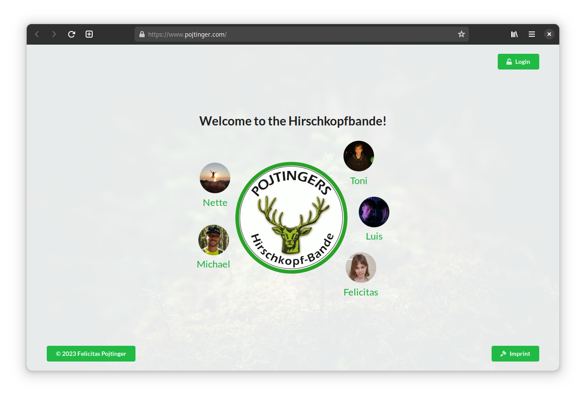
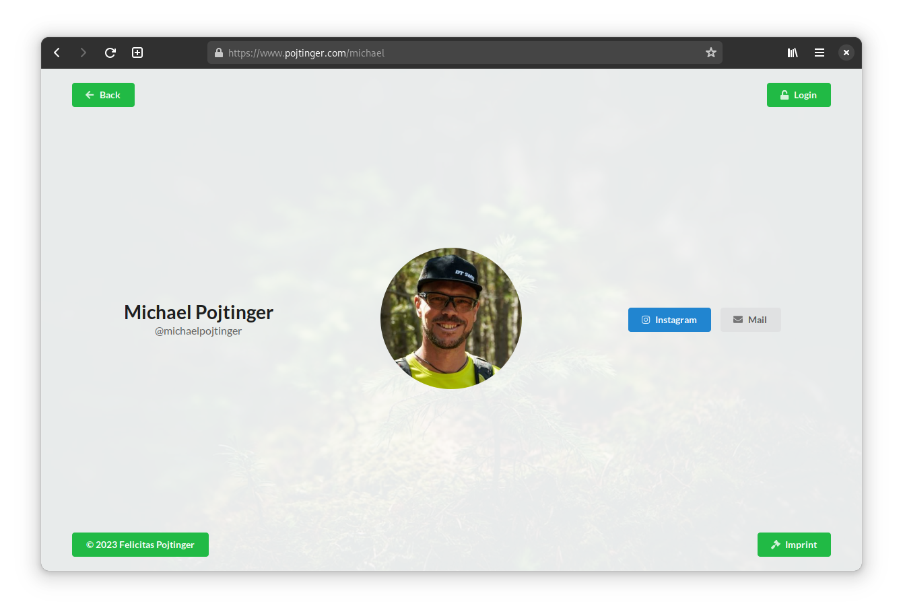

# Family Site

A site for my family.

## Overview

This is a site for my family that links to each person's socials.

It provides the following information:

- Profile pictures
- Social accounts (Instagram etc.)
- Mail addresses
- Personal website links (if available)

## Installation

Simply visit the [public deployment](https://pojtinger.com/) to access the site:

[](https://pojtinger.com/)

## Screenshots

Click on an image to see a larger version.

<a display="inline" href="./docs/screenshot-home.png?raw=true">

</a>

<a display="inline" href="./docs/screenshot-person.png?raw=true">

</a>

## Acknowledgements

- [parcel-bundler/parcel](https://parceljs.org/) provides the build system.
- [Semantic-Org/Semantic-UI-React](https://react.semantic-ui.com/) provides the design system.

## Contributing

To contribute, please use the [GitHub flow](https://guides.github.com/introduction/flow/) and follow our [Code of Conduct](./CODE_OF_CONDUCT.md).

To build the site locally, run:

```shell
$ git clone https://github.com/pojntfx/pojtinger.com.git
$ cd pojtinger.com
$ npm install --legacy-peer-deps
$ npm run dev
```

## License

Family Site (c) 2024 Felicitas Pojtinger

SPDX-License-Identifier: AGPL-3.0
